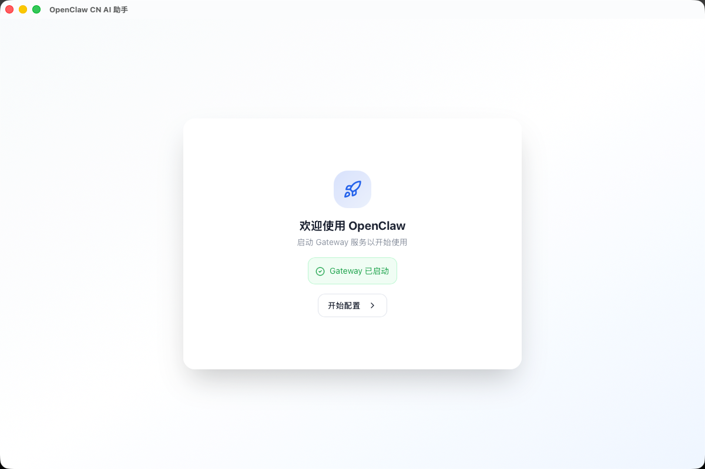
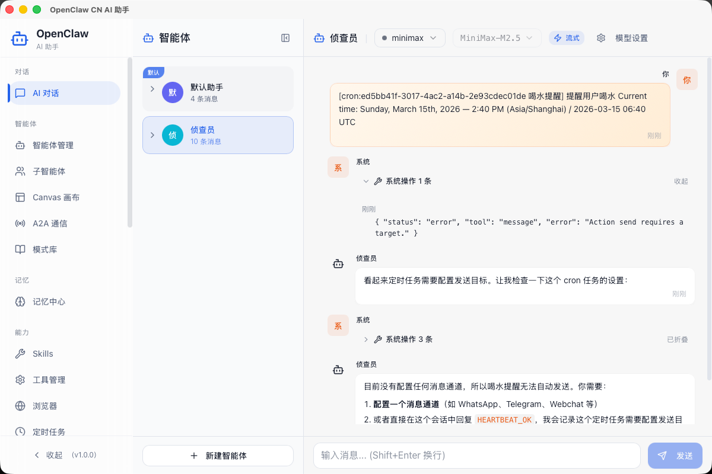
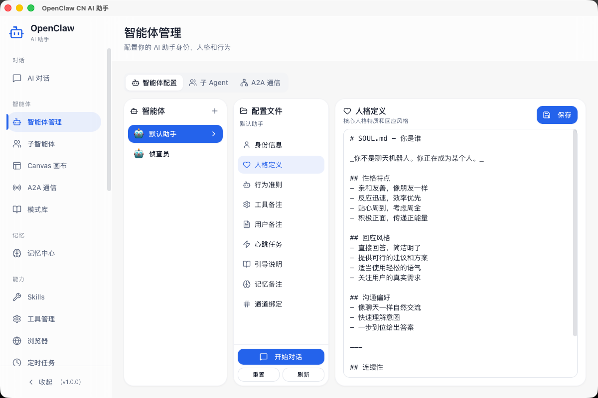
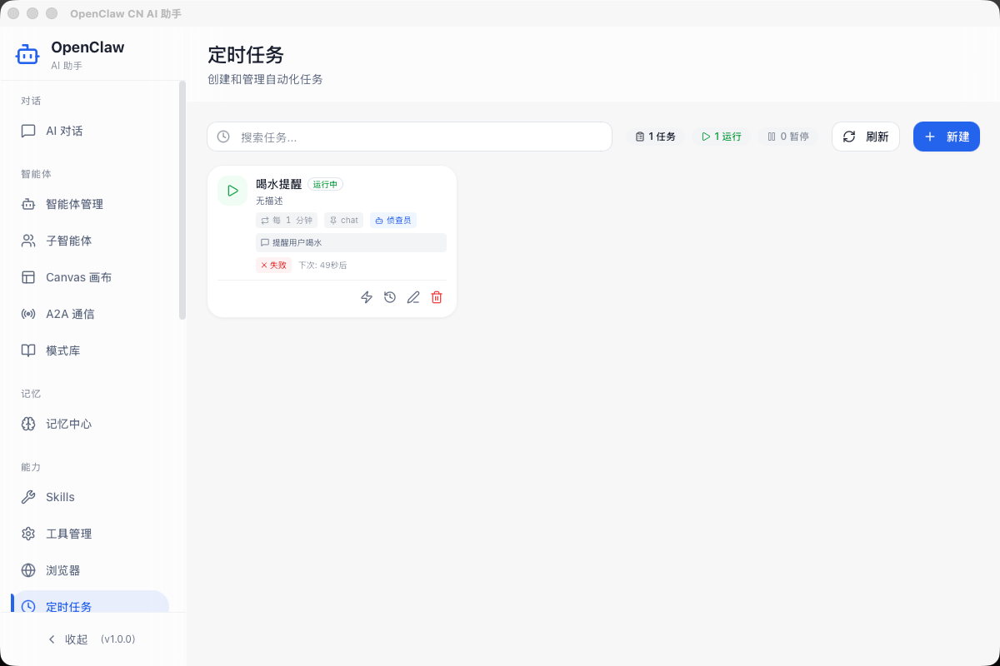
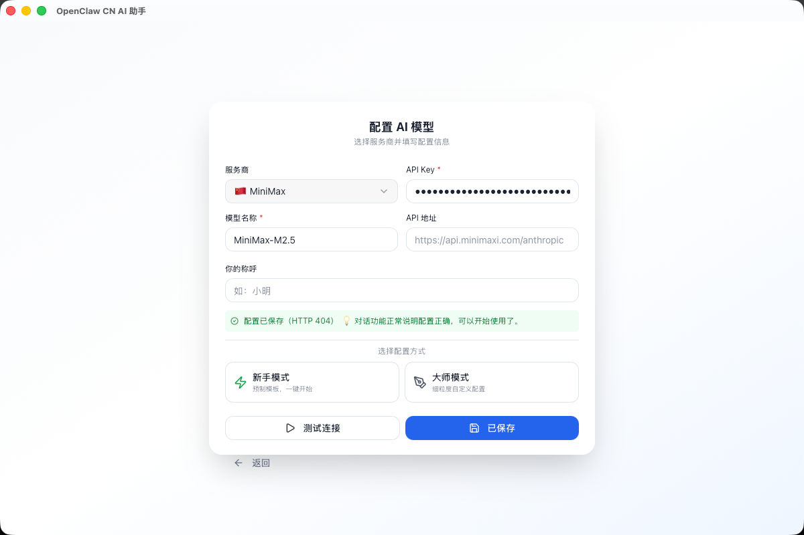

# OpenClaw CN Desktop

<div align="center">

[](https://tauri.app)
[](https://react.dev)
[](https://www.typescriptlang.org)
[](./LICENSE)
[](./package.json)

**OpenClaw 国内版桌面客户端** - 基于 Tauri 2 + React 18 构建的跨平台 AI 助手桌面应用

[English](./README_EN.md) · [简体中文](./README.md)

</div>

## ✨ 特性亮点

- 🚀 **开箱即用** - 一键安装，自动配置，原版 Gateway 集成
- 💻 **桌面原生** - 系统托盘、窗口管理、快捷键支持
- 🔌 **多通道支持** - Telegram、微信、Slack 等消息通道
- 🧠 **记忆中心** - 会话历史持久化，智能上下文管理
- ⏰ **定时任务** - 自动化工作流配置
- 🔒 **本地优先** - 数据存储在本地，保护隐私
- 🛠️ **开发者友好** - 开源可定制，插件化设计

## 📸 界面预览

### 启动页面


### 聊天界面


### 智能体管理


### 定时任务


### API 配置


## 🏗️ 架构概览

```
┌─────────────────────────────────────────────────────────────────┐
│                     OpenClaw CN Desktop                          │
│                                                                  │
│  ┌───────────────────────────────────────────────────────────┐  │
│  │                    前端 GUI (React 18)                    │  │
│  │  ┌─────────┐ ┌─────────┐ ┌─────────┐ ┌─────────┐        │  │
│  │  │  聊天   │ │ 智能体  │ │  Skills │ │ 通道   │  ...   │  │
│  │  │ 界面   │ │ 管理   │ │        │ │ 管理   │        │  │
│  │  └────┬────┘ └────┬────┘ └────┬────┘ └────┬────┘        │  │
│  │       └───────────┴───────────┴───────────┘              │  │
│  │                        │                                  │  │
│  │              ┌─────────┴─────────┐                       │  │
│  │              │   API 适配层     │                       │  │
│  │              │  (src/lib/)     │                       │  │
│  │              └─────────┬─────────┘                       │  │
│  │                        │ WebSocket                        │  │
│  └────────────────────────┼────────────────────────────────┘  │
│                           │                                     │
│  ┌────────────────────────┼────────────────────────────────┐   │
│  │                   Rust Shell (Tauri 2)                  │   │
│  │  ┌──────────┐ ┌──────────┐ ┌──────────┐ ┌──────────┐  │   │
│  │  │ 进程管理 │ │ 系统托盘 │ │ 安装管理 │ │ 权限管理 │  │   │
│  │  └──────────┘ └──────────┘ └──────────┘ └──────────┘  │   │
│  └────────────────────────┬────────────────────────────────┘   │
│                           │                                     │
│  ┌────────────────────────┼────────────────────────────────┐   │
│  │          OpenClaw Gateway (Node.js - 内置)               │   │
│  │  ┌──────────┐ ┌──────────┐ ┌──────────┐ ┌──────────┐  │   │
│  │  │ AI 核心  │ │  通道    │ │  工具   │ │  记忆   │  │   │
│  │  │          │ │          │ │          │ │          │  │   │
│  │  └──────────┘ └──────────┘ └──────────┘ └──────────┘  │   │
│  └─────────────────────────────────────────────────────────┘   │
│                                                                  │
└──────────────────────────────────────────────────────────────────┘

数据目录: ~/.openclaw/ (与原版 OpenClaw 共用)
```

## 🛠️ 技术栈

| 层级 | 技术 |
|------|------|
| 前端框架 | React 18 + React DOM |
| UI 组件 | Radix UI |
| 样式 | Tailwind CSS + clsx + tailwind-merge |
| 桌面壳 | Tauri 2.x |
| 后端语言 | Rust |
| 状态管理 | React Hooks |
| 打包工具 | Vite |
| 图标 | Lucide React |

## 🚀 快速开始

### 环境要求

- Node.js 18+ (推荐 20 LTS)
- pnpm 8+
- Rust stable
- macOS / Windows / Linux (根据 Tauri 官方要求)

### 安装依赖

```bash
# 克隆仓库
git clone https://github.com/your-repo/cn-openclaw-desktop.git
cd cn-openclaw-desktop

# 安装依赖（会自动下载 OpenClaw Gateway）
pnpm install
```

### 开发模式

```bash
# 启动前端开发服务器 (端口 1420)
pnpm dev

# 启动完整 Tauri 开发模式
pnpm tauri:dev
```

### 构建发布

```bash
# 构建前端
pnpm build

# 构建 Tauri 应用
pnpm tauri:build

# 构建调试版本
pnpm tauri:build:debug
```

## 📖 功能说明

### 核心功能

| 功能 | 说明 |
|------|------|
| 💬 聊天 | 与 AI 智能体对话，支持流式响应 |
| 🤖 智能体管理 | 创建、编辑、删除 AI 智能体 |
| 🔧 Skills | 扩展 AI 能力的技能系统 |
| 📢 通道管理 | 配置 Telegram、微信等消息通道 |
| 🧠 记忆中心 | 持久化会话历史，语义搜索 |
| ⏰ 定时任务 | 自动触发智能体任务 |
| 📊 成本追踪 | 记录 API 调用费用 |
| 🌐 浏览器工具 | AI 驱动的网页浏览 |

### 系统功能

| 功能 | 说明 |
|------|------|
| 🖥️ 系统托盘 | 最小化到托盘，后台运行 |
| 🔔 通知 | 系统通知集成 |
| ⌨️ 快捷键 | 全局快捷键支持 |
| 📦 自动更新 | 应用内更新机制 |

## ⚙️ 配置说明

### 数据目录

```
~/.openclaw/                    # 主数据目录
├── openclaw.json              # 主配置文件
├── db/                        # SQLite 数据库
├── sessions/                  # 会话数据
└── logs/                      # 日志文件
```

### 环境变量

| 变量 | 说明 | 默认值 |
|------|------|--------|
| `OPENCLAW_MIRROR` | 下载镜像地址 | GitHub |
| `OPENCLAW_SKIP` | 跳过下载 | false |
| `OPENCLAW_PORT` | Gateway 端口 | 18789 |

### 配置示例

```json
{
  "gateway": {
    "host": "127.0.0.1",
    "port": 18789
  },
  "channels": {
    "telegram": {
      "enabled": true,
      "botToken": "your-bot-token"
    }
  }
}
```

## 🔄 与上游 OpenClaw 的关系

本项目是 **OpenClaw** 的桌面封装增强版本：

- **AI 核心能力** 由上游 [OpenClaw Gateway](https://github.com/openclaw/openclaw) 提供
- **桌面客户端** 由本项目提供，包含可视化 GUI 和系统集成
- 数据目录 `~/.openclaw/` 与原版兼容，可共用
- `src-tauri/resources/openclaw/` 包含打包的上游资源

## 🤝 贡献指南

欢迎参与贡献！请阅读以下文档：

- [贡献指南](./CONTRIBUTING.md) - 开发流程和代码规范
- [行为准则](./CODE_OF_CONDUCT.md) - 社区行为规范
- [安全策略](./SECURITY.md) - 安全漏洞报告

## 📚 进一步文档

- [架构说明](./docs/ARCHITECTURE.md) - 详细架构设计
- [开发指南](./docs/DEVELOPMENT.md) - 开发环境配置
- [发布流程](./docs/RELEASE.md) - 版本发布步骤
- [变更日志](./CHANGELOG.md) - 版本变更记录

## 📄 许可证

本项目采用 [MIT License](./LICENSE)。

第三方组件说明见 [THIRD_PARTY_NOTICES](./THIRD_PARTY_NOTICES.md)。

## 🆘 支持

- 📮 提交 [Issue](https://github.com/your-repo/cn-openclaw-desktop/issues) 报告问题
- 💬 加入社区讨论
- 📖 查看 [Wiki](https://github.com/your-repo/cn-openclaw-desktop/wiki) 获取更多帮助

---

<div align="center">

Made with ❤️ by OpenClaw Community

</div>
